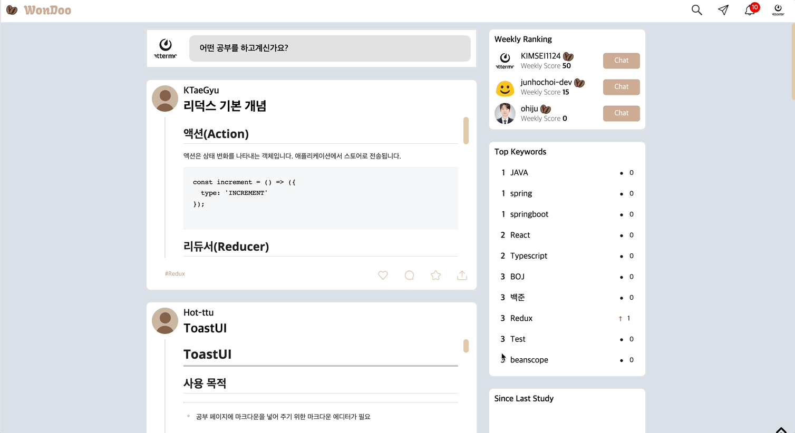
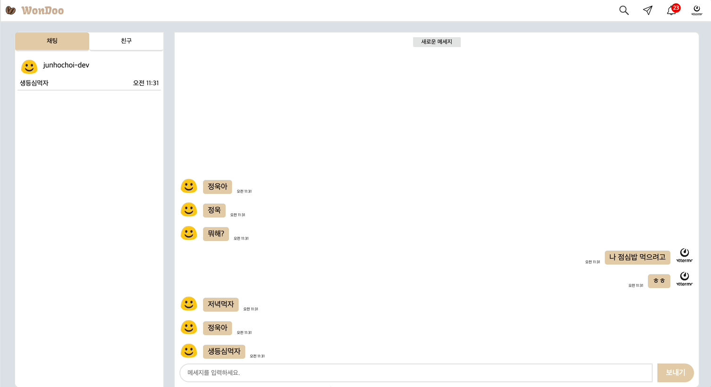

# Wondoo

## 1. 개요

<타겟> - 개발자

1. 꾸준하게 기록하면서 공부하고 하는 개발자들
2. 개발 입문자
3. 개발 공부하는데 헤매는 사람
4. 개발 공부한 것을 정리하거나 관리하기 귀찮은 사람
5. 취준 개발자
6. 인강을 사도 완강이 힘든 개발자들

<서비스>

1. 키워드 기반 개발 공부 피드
   1. 댓글으로 토론 가능 → 코드 리뷰를 원하면 리뷰어가 해당 코드를 리뷰하고 다른 리뷰어들도 토론을 할 수 있다.
2. 깃허브 기반 개발 타이머
3. 공부한 내용 깃허브 정리
   - 자동 커밋
4. 개발 관련 공유 커뮤니티
5. 대인 멘토링 (PT)

<기대 효과>

1. 매일 공부한 내용을 자동으로 정리해줌으로써 본인의 공부 습관, 내용 등을 한눈에 파악 가능
2. 개발을 시작한 사람이라면 여러 기능들을 통해 방향성을 잡아갈 수 있음

## 2. 개발 환경

[ Frontend ]

- Vite 5.0.8
- React 18.2.0
- typescript 5.2.2

[ Backend ]

- Java 17.0.x
- Spring Boot 3.2.x

[ DB ]

- H2(TEST)
- MySQL
- MongoDB
- REDIS
- ElasticSearch

## 3. 서비스 화면

## 4. 주요 기능

1. 공부한 내용으로 피드 작성 및 등록
2. 공부중인 데이터 임시 저장
3. 피드에 등록한 키워드 기반 유저간 연관도 분석
4. 피드에 등록한 키워드 기반 유저-피드 연관도 분석
5. GPT를 활용한 커밋 내역 기반 다이어리 자동 생성
6. 유저 활동 기반 포인트, 랭킹 부여
7. 유저 활동 기반 통계 데이터 열람
8. 공부 계획표 작성
9. 채팅
10. 알람

## 5. 기술 소개

[ BE ]

- Spring Data JPA + QueryDSL
- SpringSecurity + JWT
- Spring Cloud
- Spring Cloud Netfilx Eureka
- STOMP
- SSE

[ FE ]

- Axios
- SockJS
- stompJS
- WebSocket
- eventSource
- Redux
- Redux-toolkit
- Redux-persist
- lodash
- Storybook
- Emotion
- Chart.js
- Toast UI Editor
- React-Ace
- sweetalert2
- lottie
- Vite

[ INFRA ]

- AWS EC2
- AWS S3
- Docker
- Nginx
- Jenkins
- SonarQube
- Zookeeper/Kafka
- RabbitMQ

## 6. 설계 문서

## 7. 팀원 소개

[김정욱]
BE, BE 팀장, Infra

[김태규]
FE, FE 팀장, 피드, 채팅, 팔로우

[오희주]
FE, 로그인, 회원가입, 피드 생성, 알림

[윤 설]
BE, MemberService, NotificationService

[최준호]
BE, 총괄 팀장, PM
LiveMessageService, StorageService,
ArticleService

[황주영]
FE, 차트, 통계, 설정, 프로필
